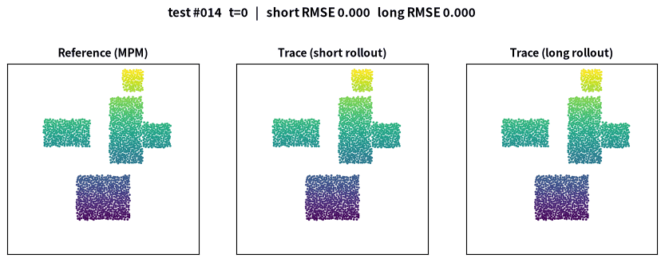
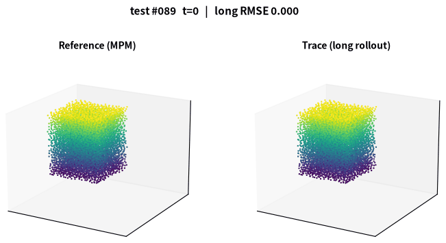
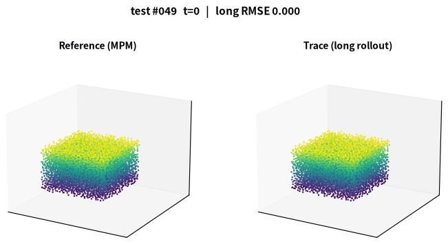
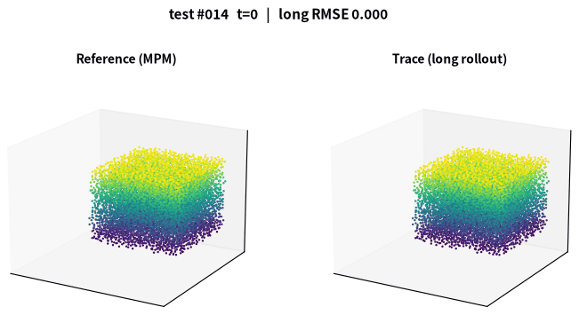
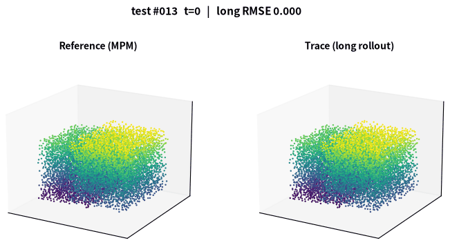
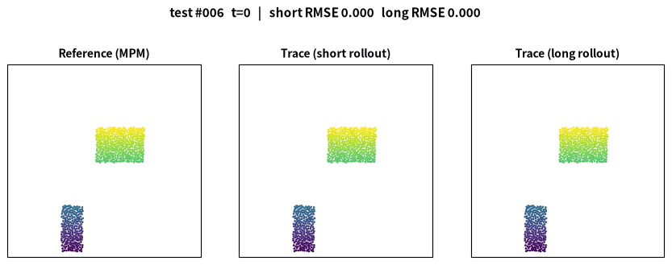
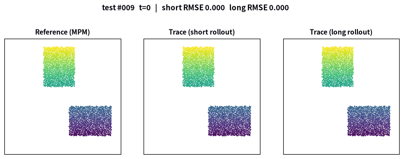
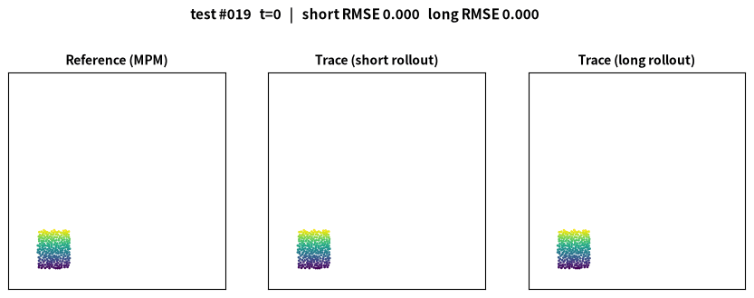

<div align="center">

# TRACE

### Spatiotemporal Contact Memory Graph Network Simulator for Granular Dynamics

[](LICENSE)
[](https://www.python.org/)
[](https://pytorch.org/)
[](#citation)

*A learned granular-flow simulator that stores interaction history **on the contact edges themselves**.*

 
<br/>
<sub>Left: 2D sand column collapse (1,723 particles). Right: 3D collapse (7,253 particles). Reference on top, 300-step autoregressive TRACE rollout below.</sub>

</div>

---

## ✨ Highlights

- 🧠 **Per-contact edge memory.** Every active contact carries a persistent state. An attention pool gathers spatial context from neighboring contacts on the same grain, and a GRU carries the state forward in time while the contact graph is rebuilt at every step. A contact-identity mechanism keeps each state attached to its contact.
- ⚙️ **Physics-structured decoder.** Contact forces are predicted pairwise, equal and opposite, so linear momentum is conserved by construction, and the tangential force is projected onto the Coulomb friction cone.
- 🧱 **Admissible states at every step.** A position-based projection removes particle overlaps, and wall constraints keep particles inside the domain.
- 🚀 **Accurate at the smallest size.** 1.08M parameters, fewer than both baselines, with the lowest rollout error and a deposit error 72–81% below GNS and NMGNS.
- 📈 **Scales to 3D.** Up to twenty thousand particles and 150k active contacts per scene, 17.7 ms per 1,000 particles per step.

## 🎬 Gallery

**3D: from seven-thousand to twenty-thousand-particle scenes**

<div align="center">
  
<br/>
<sub>7,214 particles (rank 2/100) &nbsp;·&nbsp; 11,180 particles (rank 50/100) &nbsp;·&nbsp; 19,762 particles (rank 76/100)</sub>
</div>

**2D: best, typical, and hardest test scenes**

<div align="center">
  
<br/>
<sub>646 particles (rank 2/30) &nbsp;·&nbsp; 1,650 particles (rank 15/30) &nbsp;·&nbsp; 240 particles (rank 30/30)</sub>
</div>

All 130 test-trajectory animations are in [`assets/`](assets), named `trajNNN_N<particles>_rankRR.gif`: 1-based trajectory number, particle count, and accuracy rank (1 = lowest rollout-averaged RMSE within the test set).

## 📊 Results

2D Sand, 30 test scenes, 300-step autoregressive rollout:

| Model | Params | Rollout RMSE ↓ | Final RMSE ↓ | Deposit error ↓ | ms / step ↓ |
| --- | --- | --- | --- | --- | --- |
| GNS   | 1.29 M | 0.159 ± 0.004 | 0.198 ± 0.015 | 0.333 ± 0.064 | **4.23 ± 0.01** |
| NMGNS | 1.43 M | 0.191 ± 0.011 | 0.267 ± 0.039 | 0.497 ± 0.183 | 8.24 ± 0.08 |
| **TRACE** | **1.08 M** | **0.110 ± 0.018** | **0.135 ± 0.020** | **0.094 ± 0.020** | 11.78 ± 0.04 |

Accuracy is the mean ± std over three random seeds. Baselines follow their original formulations and apply no constraint projection, so their particles interpenetrate by 33–40% of a diameter late in the rollout while TRACE stays near zero.

## 📁 Repository layout

```
trace/          TRACE model package (train.py + tracegnn/)
baselines/      GNS and NMGNS re-implementations (gns/, nmgns/)
common/         shared data loading, training loop, evaluation, rendering
configs/        YAML configs for Sand-2D and Sand-3D (+ memory ablations)
scripts/        evaluation, timing, and rendering utilities
checkpoints/    trained model weights (TRACE 2D/3D, GNS, NMGNS; ~4 MB each)
assets/         rollout GIFs for all 130 test trajectories
docs/           dataset download and preparation instructions
```

## 🔧 Installation

```bash
pip install -r requirements.txt
```

PyTorch and PyTorch Geometric should match your CUDA version; see their install pages.

## 📦 Datasets

We use the Sand (2D) and Sand-3D benchmarks of Sanchez-Gonzalez et al. (ICML 2020), converted to HDF5. See [docs/DATASETS.md](docs/DATASETS.md). Expected layout:

```
datasets/008-Sand-2D/{train,valid,test}.h5 + metadata.json
datasets/009-Sand-3D/{train,valid,test}.h5 + metadata.json
```

## 🏋️ Training

TRACE trains in two stages (teacher-forced pretraining, then constrained rollout fine-tuning):

```bash
# Sand-2D (single GPU)
python trace/train.py --config configs/sand2d/trace_pretrain.yaml
python trace/train.py --config configs/sand2d/trace_finetune.yaml   # set init_from to the stage-1 checkpoint

# Sand-3D (4-GPU data parallel)
torchrun --nproc_per_node=4 trace/train.py --config configs/sand3d/trace_pretrain.yaml
torchrun --nproc_per_node=4 trace/train.py --config configs/sand3d/trace_finetune.yaml
```

Baselines (single-stage teacher forcing, per their original formulations):

```bash
python baselines/gns/train.py   --config configs/sand2d/gns.yaml
python baselines/nmgns/train.py --config configs/sand2d/nmgns.yaml
```

Memory ablations (`none`, `spatial`, `gru`, `st`) live in `configs/sand2d/ablations/`.

## 📏 Evaluation and rendering

```bash
python scripts/score_all_2d.py        # long-rollout metrics table for a set of checkpoints
python scripts/time_inference.py      # wall-clock timing with warm-up and synchronization
python scripts/render_rollout.py      # side-by-side reference/prediction animations
```

Trained paper checkpoints are in [`checkpoints/`](checkpoints).

## 📖 Citation

```bibtex
@article{trace2026,
  title   = {TRACE: Spatiotemporal Contact Memory Graph Network Simulator for Granular Dynamics},
  author  = {...},
  journal = {...},
  year    = {2026}
}
```

## 📄 License

Released under the [MIT License](LICENSE).
