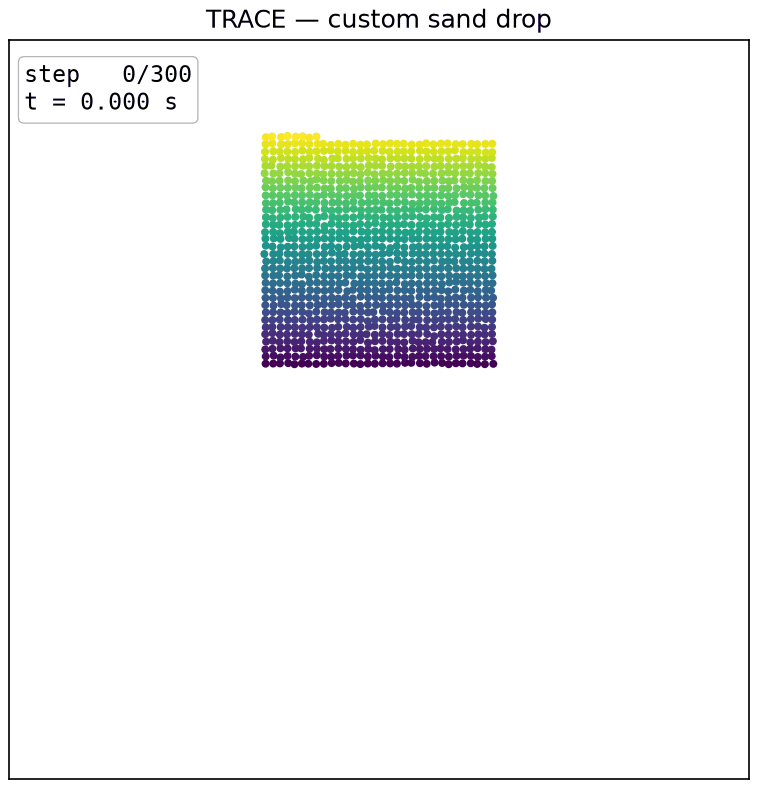

# Free drop

A trained TRACE model drops a rectangular sand pile of about 1000 grains under gravity and predicts the collapse. This is the in-distribution demo. It uses only the box boundary the model was trained on, so it is the most reliable of the three scenes.

<p align="center"></p>

## The problem

We build a block of sand grains on a lattice near the middle of the domain, give every grain the same initial velocity, and release it. Under gravity the block falls, hits the floor, and spreads into a pile. TRACE predicts the whole motion by itself. There is no reference trajectory and no ground truth. The model runs as a forward physics engine.

The scene is fully specified by two things. The first is where the block sits and how big it is. The second is the uniform initial velocity applied to every grain. The default is a downward drop with vy = -0.010 displacement per frame.

## Boundary conditions

This scene uses only the model's native box boundary. These are the exact boundaries TRACE saw during training on free-surface column collapse in a flat box.

| Boundary | Location | Type |
|---|---|---|
| Floor | horizontal line at y = radius | native, in-distribution |
| Left wall | vertical line at x = radius | native, in-distribution |
| Right wall | vertical line at x = L - radius | native, in-distribution |

There are no custom wall particles and no added geometry. Every boundary here is one the model was trained with, so the prediction is in-distribution. This is essentially the training scenario. You should trust the qualitative and quantitative behavior of this demo more than the slope or plate demos, which push the model onto out-of-distribution geometry.

The domain is the shifted box [0, L] x [0, L] with L = 0.8. The floor sits at y = radius. The side walls sit at x in [radius, L - radius]. Grains are kept inside by a hard wall clamp after every step.

## What you provide (inputs)

You hand the model one initial state. Everything after that is predicted.

| Input | Shape | Meaning | Value in this scene |
|---|---|---|---|
| pos_0 | (N, 2) | initial positions in the box frame [0, L]^2 | a lattice block from build_pile |
| vel_0 | (N, 2) | initial velocity as displacement per frame, not m/s | uniform (vx, vy), default (0, -0.010) |
| radius | (N,) | grain radius the model was trained with | 0.0036 |
| node_type | (N,) | particle type, sand is 0 | 0 |

Velocity is displacement per frame. The model folds the physical time step into 1.0 and reads velocity as v[t] = x[t] - x[t-1]. The training data has a per-frame displacement std of about 0.0025. A gentle initial speed is a few thousandths of the box per frame. A fast drop is around 0.01.

Scene-specific parameters for this demo:

| Parameter | Meaning | Default |
|---|---|---|
| --n | target grain count | 1000 |
| --cx | pile center x | 0.40 |
| --y | pile bottom height | 0.45 |
| --vx | initial x velocity (disp/frame) | 0.0 |
| --vy | initial y velocity (disp/frame), negative is downward | -0.010 |
| --steps | rollout length in frames | 300 |

Fixed by the checkpoint, do not change these:

| Constant | Value |
|---|---|
| L (domain size) | 0.8 |
| radius | 0.0036 |
| dt (model time step) | 1.0 |
| checkpoint | checkpoints/sand2d/trace_2d_final.pt |

The checkpoint is the stage-2, rollout fine-tuned final 2D model.

## How the prediction works

TRACE is a learned single-step transition function. Inference is autoregressive. You give it one initial state, frame 1, and it repeatedly predicts the next state from the current one. There is no loss and no ground truth. It is pure forward simulation.

Each simulation step does the following.

1. Build the contact graph from the current positions. An edge connects two grains whose center distance is below skin * (r_i + r_j). The connectivity radius is 0.015, which is a skin factor of about 2.083 at grain radius 0.0036.
2. Encode each node from its recent velocity, its distances to the domain walls, its type, and its radius. Encode each edge from the relative position of its two grains.
3. Retrieve and update the per-contact edge memory. Each active contact carries a state. An attention pool gathers context from neighboring contacts on the same grain. A GRU carries the state forward in time. A contact-identity mechanism keeps each state attached to its contact as the graph is rebuilt.
4. Run 8 rounds of message passing.
5. The physics-structured decoder outputs, for each contact, a non-negative normal force, a tangential force clamped to the Coulomb friction cone, and a friction coefficient. It also outputs one body-force acceleration per node. The contact force is applied to the two grains with equal magnitude and opposite direction, so momentum is conserved.
6. Integrate with semi-implicit Euler. First v <- v + a*dt, then x <- x + v*dt. Here dt is 1.0, so velocity is read as displacement per frame.
7. Apply the hard geometric constraints. A non-penetration projection pushes overlapping pairs apart with 25 Jacobi iterations per step. A box-wall clamp keeps grains inside the domain, with the floor at y = radius and the side walls at x in [radius, L - radius].

## Running it

```bash
/data/envs/trace/bin/python demo/01-free-drop/run.py --gpu 0
```

Options:

- `--n` particle count (default 1000)
- `--vy` initial downward velocity in displacement per frame (default -0.010)
- `--vx` initial horizontal velocity in displacement per frame (default 0.0)
- `--cx` pile center x (default 0.40)
- `--y` pile bottom height (default 0.45)
- `--steps` rollout length in frames (default 300)
- `--gpu` CUDA device index, or `cpu`
- `--out` output GIF path (default demo/01-free-drop/free_drop.gif)

Example with a faster, wider drop:

```bash
/data/envs/trace/bin/python demo/01-free-drop/run.py --gpu 0 --n 1500 --vy -0.012 --steps 300
```

## Inference time

Measured on a single NVIDIA RTX 4090 with CUDA synchronization, timing only the rollout loop and not the rendering.

| Particles | Steps | Total | Per step |
|---|---|---|---|
| 1000 | 300 | 3.84 s | 12.8 ms |

The GIF encoding runs after the loop and is not included in these numbers.

## Outputs

- `free_drop.gif` — the animation of the collapse, with a step and time counter in the corner.

The script also prints the scene setup and the measured rollout timing to the console.

## How the figure is computed

`free_drop.gif` is a direct visualization of the model's forward prediction. Nothing is post-processed or fitted.

1. The trained weights are loaded from `checkpoints/sand2d/trace_2d_final.pt` and checked into the model with `load_state_dict`.
2. `model.rollout` is called once. It runs the autoregressive loop described above, predicting the acceleration of every grain at every step and integrating it. The acceleration, including gravity, comes entirely from the model weights. There is no hardcoded gravity.
3. The returned trajectory is a list of frames. Each frame is the predicted position of every grain at that step.
4. Frame `i` of the GIF plots those positions as a scatter. Each grain is colored by its initial height, so you can follow the same grain across the collapse.
5. The counter shows `step i` and the physical time `t = i * 0.0025 s`, using the dataset time step.

So every dot you see is a position predicted by the network. The only inputs are the initial block and its velocity.