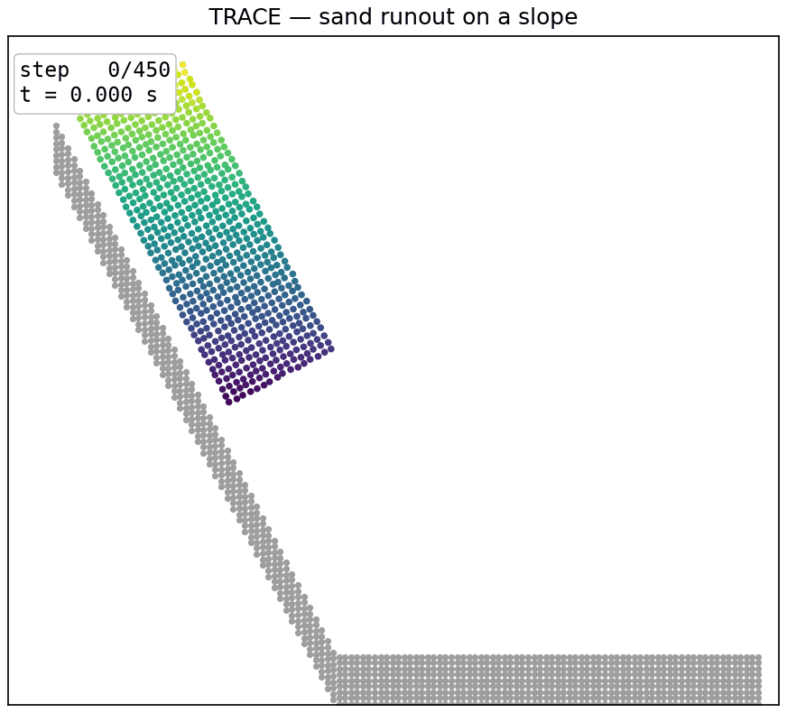

# Runout on a slope

A rectangular block of sand slides down a rigid incline and spreads across the flat runout at the bottom. The demo shows the TRACE learned granular simulator generalizing to a slope boundary it never saw during training.

<p align="center"></p>

## The problem

We simulate a small block of dry sand released on an inclined surface. Gravity, which the model learned from data, pulls the block down the slope tangent. The block accelerates, reaches the horizontal runout at the toe of the incline, and spreads out into a shallow deposit. This is a classic granular runout setup. Here it serves one purpose: to test whether TRACE, trained only on free-surface column collapse in a flat box, can behave sensibly against a boundary geometry it was never shown.

TRACE is a learned single-step transition function. Inference is autoregressive. You give it one initial state (frame 1), and it repeatedly predicts the next state from the current one. There is no ground truth and no loss during inference. It is pure forward simulation, like running a physics engine.

## Boundary conditions

This scene has two kinds of boundary, and they are not equally trustworthy.

**Native boundaries (in-distribution).** The model has a flat floor at `y = radius` and vertical side walls at `x` in `[radius, L - radius]` built into its hard constraint step. These are the only boundaries the model saw in training. Training data was free-surface sand column collapse inside a flat box. Against these boundaries the model is operating inside its training distribution and its behavior is the validated behavior.

**The slope (out-of-distribution).** The incline is not a native boundary. It is built from a dense band of FIXED "wall particles" that never move. The custom rollout re-freezes those particles every step, so the band acts as a rigid, impermeable surface. The moving sand grains feel the slope only through the same learned repulsive contact forces they feel from any other grain. The model was never trained on an inclined surface, so this is an out-of-distribution use.

What this means for trust: the slope result is a qualitative demonstration of generalization, not a validated quantitative prediction. The runout distance, the deposit shape, and the flow timing look physically plausible, but they have not been checked against a reference solver or experiment. Treat the flat-box parts as reliable and the slope interaction as a plausibility check.

## What you provide (inputs)

The model consumes four per-particle arrays plus a few scene parameters. The domain and grain constants are fixed by the checkpoint and should not be changed.

| Input | Shape | Meaning |
|---|---|---|
| `pos_0` | `(N, 2)` | initial positions in the box frame `[0, L]^2`, `L = 0.8`. Concatenation of the frozen slope particles followed by the sand grains. |
| `vel_0` | `(N, 2)` | initial velocity as DISPLACEMENT PER FRAME, not m/s. Slope particles are zero. Sand grains get `speed * tangent` along the downhill direction. |
| `radius` | `(N,)` | grain radius, `0.0036` for every particle, the value the model was trained with. |
| `node_type` | `(N,)` | particle type. Sand is `0`. All particles here are type `0`. |

Scene-specific parameters for this demo:

| Parameter | Default | Meaning |
|---|---|---|
| slope heel | `(0.04, 0.62)` | upper start point of the incline |
| slope toe | `(0.34, 0.05)` | lower end where the slope meets the flat runout |
| initial speed | `0.007` | downhill displacement per frame given to the block. For reference, training data has a per-frame displacement std of about `0.0025`, so a gentle speed is a few thousandths and a fast one is about `0.01`. |
| block size | up to `1500` sand grains | the rectangular block, built aligned to the slope tangent by `build_pile`. With defaults this produces `688` sand grains. |
| steps | `450` | rollout length |

Fixed by the checkpoint: `L = 0.8`, `radius = 0.0036`, `dt = 1.0`. Checkpoint file: `checkpoints/sand2d/trace_2d_final.pt`, the stage-2 rollout fine-tuned final 2D model.

## How the prediction works

Each simulation step maps the current state to the next state. The loop runs these operations.

1. **Build the contact graph.** From the current positions, an edge connects two grains whose center distance is below `skin * (r_i + r_j)`. The connectivity radius is `0.015` (skin factor about `2.083`, grain radius `0.0036`).
2. **Encode nodes and edges.** Each node is encoded from its recent velocity, its distances to the domain walls, its type, and its radius. Each edge is encoded from the relative position of its two grains.
3. **Retrieve and update edge memory.** Each active contact carries a per-contact state. An attention pool gathers context from neighboring contacts on the same grain, and a GRU carries the state forward in time. A contact-identity mechanism keeps each state attached to its own contact while the graph is rebuilt every step.
4. **Message passing.** Run 8 rounds of message passing over the contact graph.
5. **Physics-structured decoder.** For each contact the decoder outputs a non-negative normal force, a tangential force clamped to the Coulomb friction cone, and a friction coefficient. It also outputs one body-force acceleration per node. Each contact force is applied to its two grains with equal magnitude and opposite direction, so momentum is conserved.
6. **Semi-implicit Euler integration.** Update velocity first, then position: `v <- v + a*dt`, then `x <- x + v*dt`. The model time step `dt` is `1.0`. The physical time step is folded into `1.0`, so velocity is read as displacement per frame.
7. **Hard geometric constraints.** A non-penetration projection pushes overlapping pairs apart with 25 Jacobi iterations per step. A box-wall clamp keeps every grain inside the domain, with the floor at `y = radius` and side walls at `x` in `[radius, L - radius]`.

On top of this shared loop, the slope demo adds one extra operation at the end of every step. It overwrites the slope particles back to their fixed positions and sets their velocity to zero. This is what keeps the incline rigid and impermeable while the sand flows over it.

## Running it

```bash
/data/envs/trace/bin/python demo/02-slope-runout/run.py --gpu 0
```

Options:

- `--speed` initial downhill speed of the block, in displacement per frame. Default `0.007`.
- `--n` maximum sand block size in grains. Default `1500`, which yields `688` grains with the default geometry.
- `--steps` rollout length. Default `450`.
- `--gpu` CUDA device index, or `cpu` to run on the CPU. Default `0`.
- `--out` output GIF path. Default `slope_runout.gif` next to the script.

## Inference time

Measured on a single NVIDIA RTX 4090 with CUDA synchronization, timing only the rollout loop and not the rendering.

- Particles: `1768` total, `688` sand grains plus `1080` fixed slope particles.
- Steps: `450`.
- Total rollout time: `6.14 s`.
- Per step: `13.6 ms`.

These numbers cover the forward simulation only. Building the scene, loading the checkpoint, and writing the animation are not included.

## Outputs

Running the script produces:

- `slope_runout.gif` — the animation of the block sliding down the slope and spreading on the runout. The frozen slope particles are drawn in gray. The sand grains are colored by their initial height, as in the paper assets. A counter shows the step index and the physical time.

Console output reports the scene size, the number of frames, the total inference time, and the per-step time.

## How the figure is computed

`slope_runout.gif` is a direct visualization of the model's forward prediction. Nothing is post-processed or fitted.

1. The trained weights are loaded from `checkpoints/sand2d/trace_2d_final.pt` and checked into the model with `load_state_dict`.
2. The scene holds two kinds of particle. The gray band is the fixed slope, and the colored grains are the moving sand. Only the sand carries an initial velocity, along the downhill tangent.
3. A custom rollout loop runs one step at a time. Each step calls `model.forward` to predict the acceleration of every particle, then integrates it with semi-implicit Euler. The acceleration, including gravity, comes entirely from the model weights. There is no hardcoded gravity.
4. After each step the slope particles are written back to their fixed positions with zero velocity. This is what makes the gray band act as a rigid, immovable surface. The sand keeps whatever the model predicted.
5. Frame `i` of the GIF plots the sand positions at step `i`, colored by initial height, with the fixed slope drawn underneath. The counter shows `step i` and `t = i * 0.0025 s`.

So the sliding and spreading you see is predicted by the network at every step. The slope is imposed geometry, and the sand response is pure forward inference.

## Note on the boundary

The slope in this demo is a trick, not a native feature of the model. The model only knows a flat-floored box. To make an incline, we lay down a thick, dense band of wall particles under the ramp surface and freeze them in place. The rollout re-freezes those particles at the end of every step, so they never move and never absorb momentum. The moving sand does not know these are special. It feels them through the same learned repulsive contact forces it feels from any grain, and it flows over them.

Two details make this hold together. The wall band is made thick and dense (nine stacked layers at tight spacing), so grains cannot tunnel through it in a single step. The flat runout sits near the native floor, so the sand settles onto a region the model already understands.

Because the model was trained on a flat box and never on an incline, this is an out-of-distribution use. The runout looks physically reasonable, but it has not been validated against a reference. Read it as a qualitative demonstration that TRACE generalizes to an unseen boundary, not as a quantitatively trusted prediction.