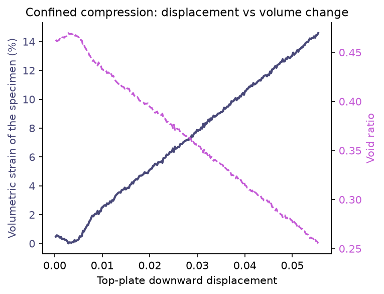
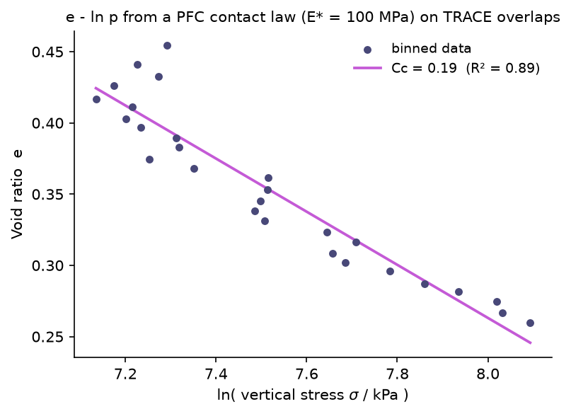

# Confined compression

A sand specimen is confined by rigid steel plates on the bottom and both sides. The top plate descends at a constant rate and compresses the specimen to a target axial strain. TRACE predicts how the grains shear, rearrange, and densify under the moving platen, and the volumetric response is measured directly from particle geometry.

<p align="center">  </p>

## The problem

This is an oedometer-style confined compression test. A packed sand specimen sits inside a rigid cell. The bottom and the two side plates are fixed. The top plate is lowered by a fixed increment every step. As the platen comes down, the grains cannot spread sideways, so they shear past each other, fill voids, and pack more tightly.

The test is displacement-driven. We impose the plate motion and measure the volumetric response. No force is applied as an input. The quantities of interest are the axial strain (how far the top plate has descended relative to the initial specimen height), the volumetric strain, and the void ratio (volume of voids over volume of solids). A dense granular material densifies under this loading, and the void ratio should drop as the specimen compresses.

The simulator runs the full loading history one step at a time and records these geometric quantities at every step.

## Boundary conditions

The domain is the fixed box `[0, L]^2` with `L = 0.8`. Inside that box, the compression cell is built from wall particles.

| Boundary | Type | In or out of distribution |
| --- | --- | --- |
| Box floor at `y = radius` and side walls at `x in [radius, L - radius]` | Native model boundary, enforced by a hard wall clamp every step | In distribution. These are the only walls the model saw in training. |
| Bottom plate and two side plates (fixed wall particles) | Custom boundary, re-frozen every step | Out of distribution |
| Top plate (wall particles, lowered by a fixed increment every step) | Custom kinematically driven boundary | Out of distribution |

The native box boundaries are built into the model. The model was trained on free-surface column collapse in a flat box, so a floor and two side walls are exactly what it learned to respect.

The compression cell is different. The bottom, side, and top plates are made of fixed wall particles that never move on their own. The custom rollout re-freezes the bottom and side plates every step and moves the top plate down by a fixed increment. The moving grains never see these plates as a special boundary type. They feel them only through the model's learned repulsive contact forces, the same forces that act between any two grains. The plates are also made impermeable by a clamp step. After each prediction, any grain that crossed a plate face is pushed back inside, so zero grains escape the cell.

What this means for trust: the model was never trained on confined compression under a platen. It never saw grains squeezed between four rigid faces. This is an out-of-distribution use of the model. The contact mechanics between grains are the learned ones, but the loading regime is new. Treat the output as a qualitative demonstration of how the learned contact model behaves under a boundary it has not seen, not as a validated soil compression test.

## What you provide (inputs)

You provide one initial state and the scene parameters. The rest is fixed by the checkpoint.

| Input | Shape | Meaning |
| --- | --- | --- |
| `pos_0` | `(N, 2)` | Initial positions of the packed specimen, in the box frame `[0, L]^2`. Built by `build_specimen`. |
| `vel_0` | `(N, 2)` | Initial velocity as displacement per frame. The specimen starts at rest, so this is zero for the sand grains. |
| `radius` | `(N,)` | Grain radius, `0.0036`, the value the model was trained with. |
| `node_type` | `(N,)` | Particle type. Sand grains are `0`. Wall particles carry the fixed-plate type. |

Scene-specific parameters:

| Parameter | Default | Meaning |
| --- | --- | --- |
| Side-plate spacing (`X_LO`, `X_HI`) | `0.26`, `0.54` | Inner faces of the two side plates. Sets the confined width. |
| Bottom plate top face (`Y_BOT`) | `0.14` | Floor of the cell. |
| Top plate initial face (`Y_TOP0`) | `0.52` | Starting bottom face of the descending platen. |
| `--rate` | `0.00022` | Top-plate descent per step, in displacement per frame. |
| `--max-strain` | `0.15` | Target axial strain. The run stops when the platen reaches this strain. |

Fixed by the checkpoint: `L = 0.8`, `radius = 0.0036`, `dt = 1.0`. Checkpoint file: `checkpoints/sand2d/trace_2d_final.pt`, the stage-2 rollout fine-tuned final 2D model.

No force is provided. The compression is entirely displacement-driven by the top plate.

## How the prediction works

TRACE is a learned single-step transition function. It takes one state and predicts the next state. Inference is autoregressive. You give it the initial packed specimen, and it repeatedly predicts the next state from the current one. There is no ground truth and no loss during inference. It is pure forward simulation, like running a physics engine. For this scene, the rollout is customized so that the plates are re-frozen each step and the top plate is advanced by `--rate`.

One simulation step does the following.

1. Build the contact graph from the current positions. An edge connects two grains whose center distance is below `skin * (r_i + r_j)`. The connectivity radius is `0.015`, which is a skin factor of about `2.083` at the training radius `0.0036`.
2. Encode each node from its recent velocity, its distances to the domain walls, its type, and its radius. Encode each edge from the relative position of its two grains.
3. Retrieve and update the per-contact edge memory. Each active contact carries a state. An attention pool gathers context from neighboring contacts on the same grain, and a GRU carries that state forward in time. A contact-identity mechanism keeps each state attached to its contact while the graph is rebuilt from step to step.
4. Run 8 rounds of message passing over the graph.
5. The physics-structured decoder outputs, for each contact, a non-negative normal force, a tangential force clamped to the Coulomb friction cone, and a friction coefficient. It also outputs one body-force acceleration per node. Each contact force is applied to its two grains with equal magnitude and opposite direction, so momentum is conserved.
6. Integrate with semi-implicit Euler. First `v <- v + a*dt`, then `x <- x + v*dt`. The model time step `dt` is `1.0`. The physical time step is folded into this, so velocity is read as displacement per frame.
7. Apply the hard geometric constraints. A non-penetration projection pushes overlapping pairs apart with 25 Jacobi iterations per step. A box-wall clamp keeps grains inside the domain, with the floor at `y = radius` and the side walls at `x in [radius, L - radius]`.

On top of these shared steps, the custom rollout re-freezes the bottom and side plates to their fixed positions, moves the top plate down by `--rate`, and clamps any grain that crossed a plate face back inside the cell. The top plate pushes the sand through the model's learned repulsive contact forces and the non-penetration projection.

## Running it

```bash
/data/envs/trace/bin/python demo/03-confined-compression/run.py --gpu 0
```

Options:

- `--max-strain` target axial strain at which to stop. Default `0.15`.
- `--rate` top-plate descent per step, in displacement per frame. Default `0.00022`.
- `--emod` PFC effective contact modulus `E*` in Pa, used for the stress and the `e-ln p` curve. Default `1e8` (100 MPa, a typical sand value). It sets the absolute stress scale and does not change the compression index `Cc`.
- `--steps` maximum number of compression steps, a safety cap. Default `600`.
- `--gpu` device index such as `0`, or `cpu`. Default `0`.
- `--outdir` output directory. Defaults to this demo folder.

## Inference time

Measured on a single NVIDIA RTX 4090 with CUDA synchronization, timing only the rollout loop and not the rendering.

| Quantity | Value |
| --- | --- |
| Total particles | 3328 (1728 sand and 1600 plate) |
| Steps to reach 15 percent strain | 252 |
| Total rollout time | 5.28 s |
| Per step | 21.0 ms |

## Outputs

- `compression.gif` the animation of the specimen compressing under the descending plate.
- `compression_curve.png` top-plate downward displacement plotted against volumetric strain and void ratio.
- `e_lnp_dem.png` void ratio against log stress, with the stress from a DEM contact law (see below).
- `compression_data.csv` one row per step with the displacement, axial strain, volumetric strain, void ratio, packing fraction, and the DEM stress columns `sigma_yy` and `p_mean`.

## How each figure is computed

Everything starts from the same forward prediction. The trained weights are loaded from `checkpoints/sand2d/trace_2d_final.pt` and checked into the model. A custom rollout runs one step at a time. Each step calls `model.forward` to predict the acceleration of every particle, integrates it with semi-implicit Euler, re-freezes the bottom and side plates, lowers the top plate by `--rate`, and clamps any grain that crossed a plate face back inside. The acceleration comes entirely from the model weights. All the measurements below are read off the predicted particle positions at each step.

**`compression.gif`.** Frame `i` plots the particle positions at step `i`. The fixed bottom and side plates are gray, the descending top plate is dark, and the sand grains are colored by initial height. The counter shows `step i` and `t = i * 0.0025 s`.

**`compression_curve.png`.** Two geometric quantities against the top-plate displacement `d = step * rate`.
- The occupied volume of the specimen is `V = W * H`, where `W` is the confined width between the side plates and `H` is the grain-column height, taken as the 99th percentile of the sand `y` positions minus the bottom plate. Only grains inside the cell are counted.
- Volumetric strain is `(V0 - V) / V0` with `V0` the initial volume.
- Void ratio is `(V - V_solid) / V_solid`, where `V_solid = N * pi * r^2` is the constant solid area of the grains.
- The left axis plots volumetric strain in percent, the right axis plots void ratio.

**`e_lnp_dem.png`.** Void ratio against log stress. The stress is not taken from the model. It is computed the DEM way from the grain overlaps.
1. At each step, find the touching grain pairs, where the center distance is below `r_i + r_j`. The overlap is `delta = (r_i + r_j) - distance`.
2. Give each contact a force with a linear contact law, `F = k_n * delta`, with `k_n = E*` and `E* = 1e8 Pa`, a PFC-typical sand modulus.
3. Form the Love-Weber stress tensor over the grain-grain contacts, `sigma = (1/A) * sum of f (x) l`, with branch vector `l = (r_i + r_j) * n`. The mean stress is `p = (sigma_xx + sigma_yy) / 2`. The model length units cancel, so `p` is in Pa. The plot uses kPa.
4. Bin the `(e, ln p)` points by axial strain into 30 bins and average within each bin, which is the quasi-static reading at each strain level.
5. Drop the first two bins, the seating phase, and fit a line `e = e0 - Cc * ln(p)`. The slope gives the compression index `Cc`. The plot shows the binned points, the fitted line, and `Cc` with `R2`.

**`compression_data.csv`.** One row per step with the raw per-step values, so you can re-bin or re-fit with your own choices.

## The stress: geometry from TRACE, force from a DEM contact law

The geometric measurements are reliable on their own. The void ratio, the volumetric strain, and the packing fraction are computed directly from particle positions and radii, with no physical calibration. In this run the volumetric strain reaches about 15 percent and the void ratio drops from about `0.46` to about `0.25` as the specimen densifies.

Stress needs force, and the model's own internal contact force is not usable here. It was never trained with force labels, and this loading regime is out of distribution. In our tests it stayed nearly flat while the specimen densified, so it does not reproduce consolidation stiffening.

Instead we get the force the DEM way. TRACE gives the geometry, which grains overlap and by how much. The force comes from a physical contact law, `F = k_n * overlap`, exactly as in PFC and DEM where the contact stiffness follows from the grain effective modulus. The specimen stress is the Love-Weber sum over the grain-grain contacts, `sigma = (1/A) * sum of f (x) l`, with branch vector `l = (r_i + r_j) * n`. As the specimen densifies, the grain-grain overlaps grow, so the stress rises. The resulting `e-ln p` curve is close to log-linear, with a compression index `Cc` near `0.19` and `R2` near `0.9`.

We use PFC-typical sand parameters so the stress comes out in a physical range. The effective contact modulus is `E* = 1e8 Pa` (100 MPa), a standard PFC value for sand. This is a contact deformability modulus, not the mineral stiffness of quartz, and PFC calibrations for sand sit near this value. The model length units cancel in the Love-Weber sum, so passing `E*` in Pa returns the stress directly in Pa. In this run the vertical stress spans roughly 200 to 3500 kPa, a realistic confined-compression range.

**This is a hybrid approximation, not a calibrated soil test.** Read the assumptions before using the numbers.

1. The contact law is a linear spring, `F = k_n * overlap`, with the stiffness set by `E* = 1e8 Pa`. Real spheres often use a Hertz law, `F` proportional to `overlap` to the power 1.5.
2. `E*` only scales all the stresses by a constant, so it shifts `ln(sigma)` by a constant. The slope `Cc` does not depend on it. The absolute stress does. Change it with `--emod`.
3. Only the normal force enters the stress. Tangential and friction contributions are ignored.
4. The stress is treated as quasi-static. The per-step force is noisy, so the curve is built by binning the data by axial strain and averaging within each bin.
5. The seating phase, the first two strain bins, is dropped before fitting `Cc`, as in a real consolidation test.
6. The largest assumption: the overlaps that TRACE produces are taken as a faithful proxy for the true contact deformation. Those overlaps come from the model's learned dynamics and its non-penetration projection, not from a calibrated force balance. So the stress inherits the model's behavior. It is a self-consistent estimate, not a first-principles measurement.

Bottom line. The shape of the `e-ln p` curve and the compression index `Cc` are the meaningful, robust outputs. The absolute stress in kPa is what you get if the grains had `E* = 100 MPa` and the TRACE overlaps were the true contact deformations. Treat this as a demonstration that a PFC contact law on TRACE geometry recovers consolidation behavior, not as a validated soil parameter.