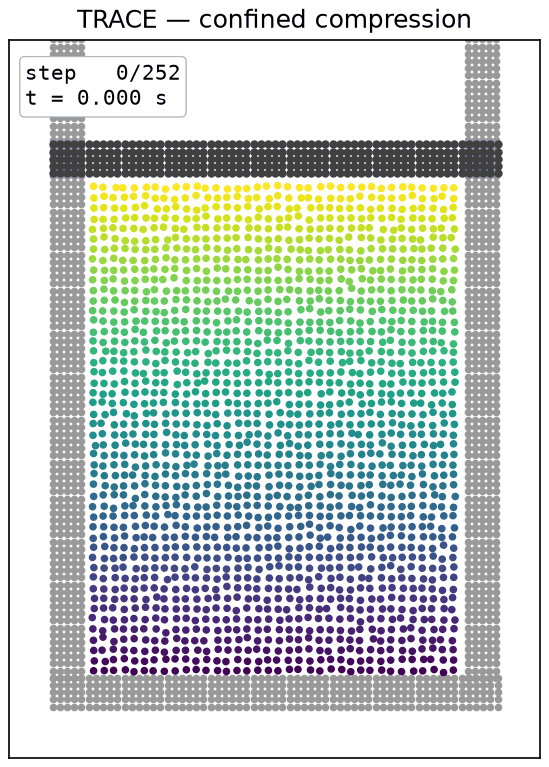

# TRACE demos

Three worked examples of using a trained TRACE checkpoint as a **forward granular
simulator** on scenes you define yourself, with no ground truth and no data files.
Each demo lives in its own folder with a detailed README.

| Demo | Scene | Distribution | Reliable outputs |
| --- | --- | --- | --- |
| [01-free-drop](01-free-drop) | a sand pile released with an initial velocity | in-distribution | trajectory, deposit shape |
| [02-slope-runout](02-slope-runout) | a block slides down an incline and spreads | out-of-distribution | qualitative motion |
| [03-confined-compression](03-confined-compression) | a specimen compressed by a moving plate | out-of-distribution | volume, void ratio |

<p align="center">
  
</p>

## How the prediction works

TRACE is a learned single-step transition function. Inference is **autoregressive**:
you give it one initial state (frame 1) and it repeatedly predicts the next state from
the current one. There is no ground truth and no loss. It runs as a forward physics
engine. One simulation step:

1. Build the contact graph from the current positions. An edge connects two grains whose center distance is below `skin * (r_i + r_j)`, giving a connectivity radius of 0.015.
2. Encode each node (recent velocity, wall distances, type, radius) and each edge (relative position).
3. Retrieve and update the per-contact edge memory. Each contact carries a state; an attention pool gathers context from neighboring contacts on the same grain, and a GRU carries the state forward in time. A contact-identity mechanism keeps each state attached to its contact as the graph is rebuilt.
4. Run 8 rounds of message passing.
5. The physics-structured decoder outputs, per contact, a non-negative normal force, a tangential force clamped to the Coulomb friction cone, and a friction coefficient, plus one body-force acceleration per node. Each contact force is applied to the two grains with equal magnitude and opposite direction, so momentum is conserved.
6. Integrate with semi-implicit Euler: `v <- v + a*dt`, then `x <- x + v*dt`. The model time step `dt` is 1.0, so velocity is read as displacement per frame.
7. Apply the hard constraints: a non-penetration projection pushes overlapping pairs apart (25 iterations per step), and a wall clamp keeps grains inside the box.

**All three demos are pure forward inference.** Every demo loads the same trained
weights (`checkpoints/sand2d/trace_2d_final.pt`) with `load_state_dict` and drives the
motion with the model's predicted acceleration (`accel_phys` from the forward pass).
There is no hardcoded gravity or force. Gravity and the contact response live in the
weights. Any figure is read off the predicted particle positions, and the compression
stress is a post-processing step applied to those positions.

## What you provide (inputs)

The model needs one initial state. Everything after that is predicted.

| Input | Shape | Meaning |
| --- | --- | --- |
| `pos_0` | (N, 2) | initial positions in the box frame `[0, L]²`, `L = 0.8` |
| `vel_0` | (N, 2) | initial velocity as **displacement per frame** (not m/s) |
| `radius` | (N,) | grain radius, `0.0036` (the trained value) |
| `node_type` | (N,) | particle type; sand is `0` |

Fixed by the checkpoint: `L = 0.8`, `radius = 0.0036`, `dt = 1.0`. All demos load
`checkpoints/sand2d/trace_2d_final.pt`, the stage-2 rollout fine-tuned final 2D model.

## Native vs custom boundaries

The model was trained with one boundary: a flat floor at `y = radius` and vertical
side walls at `x` in `[radius, L - radius]`. The **free-drop** demo uses only this
native boundary, so it is in-distribution and the most trustworthy.

The **slope** and **compression** demos add extra boundaries built from fixed "wall
particles" that the sand feels through the learned contact forces. This is an
out-of-distribution use of the model. The motion is a qualitative demonstration of
generalization, not a validated prediction. In particular the compression demo gives
reliable geometry (volume, void ratio) but the model's internal contact force is not
a calibrated stress, so a consolidation `e-ln p` curve cannot be produced reliably.
See [03-confined-compression](03-confined-compression) for the full discussion.

## Inference time (single RTX 4090, rollout loop only)

| Demo | Particles | Steps | Total | Per step |
| --- | --- | --- | --- | --- |
| 01-free-drop | 1,000 | 300 | 3.84 s | 12.8 ms |
| 02-slope-runout | 1,768 | 450 | 6.14 s | 13.6 ms |
| 03-confined-compression | 3,328 | 252 | 5.28 s | 21.0 ms |

## Running

```bash
/data/envs/trace/bin/python demo/01-free-drop/run.py           --gpu 0
/data/envs/trace/bin/python demo/02-slope-runout/run.py        --gpu 0
/data/envs/trace/bin/python demo/03-confined-compression/run.py --gpu 0
```

Pass `--gpu cpu` to run without a GPU. See each demo's README for its options.
